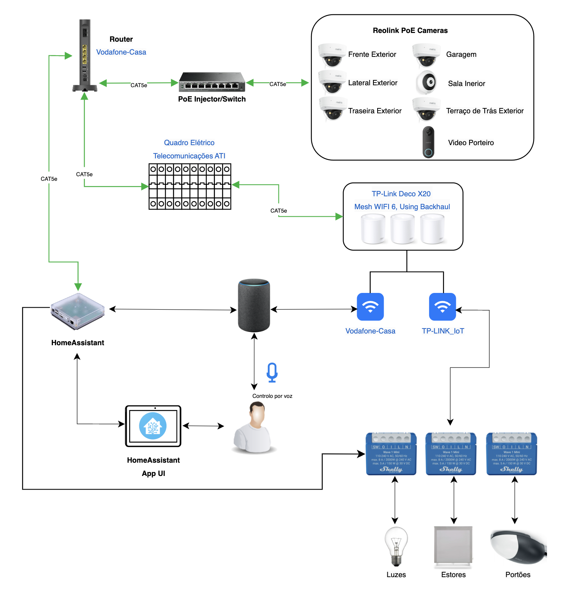

# 🏠 Home Assistant Canidelo

Este repositório contém a documentação e configuração do Home Assistant da minha casa.

---

## 📋 Índice

1. [Como Funciona e Estrutura](#como-funciona-e-como-está-montada-a-estrutura)
2. [Setup do Home Assistant](#setup-do-home-assistant)
3. [Dispositivos Conectados e Configuração](#dispositivos-conectados-e-configuração)
  - [Câmaras](docs/cameras.md)
  - [Luzes](docs/lights.md)
  - [Persianas](docs/blinds.md)
  - [Sensores](docs/sensors.md)
  - [Portas e Portões](docs/doors-and-gates.md)
4. [Rotinas e Automações](docs/automations.md)
---

## 🔧 Como Funciona e Como Está Montada a Estrutura

Este sistema de automação residencial utiliza o **Home Assistant** como central para controlar e monitorizar dispositivos conectados, dividindo-os em redes específicas para garantir segurança e eficiência. Cada categoria de dispositivo está documentada para facilitar a manutenção.

### Estrutura da Rede

Este sistema de automação residencial foi desenvolvido para integrar dispositivos IoT, como os Shelly, utilizando o **Home Assistant** e a **Alexa** para controle inteligente de iluminação, segurança e conforto em casa. A estrutura da rede é organizada em duas partes:

1. **Rede Principal - Vodafone-casa**:
    - **Conectividade**: Rede onde estão conectados o Home Assistant, Alexa, dispositivos principais e câmaras Reolink (incluindo o vídeo porteiro) através de **Ethernet**, garantindo estabilidade e desempenho elevado.

2. **Rede IoT - TP-LINK_IoT**:
    - **Isolamento de Dispositivos IoT**: Criada pelo sistema Deco Mesh TP-Link X20, esta rede isola dispositivos IoT, proporcionando segurança extra e evitando congestionamento da rede principal, melhorando a eficiência geral da rede doméstica.

---

### Arquitetura da Rede

A rede começa com o **router Vodafone**, que recebe a conexão de fibra e distribui a internet por toda a casa, tanto via **Wi-Fi** quanto por **Ethernet** através do quadro elétrico. A configuração é a seguinte:

- **Home Assistant e Câmaras Reolink**:
    - Conectados diretamente ao router via **Ethernet** para garantir uma conexão estável. As câmaras e o vídeo porteiro utilizam o sistema **PoE (Power over Ethernet)**, que transmite tanto a alimentação elétrica quanto os dados pelo mesmo cabo, simplificando a instalação e aumentando a fiabilidade da conexão.
    - O **switch PoE** distribui energia e dados para cada câmara, tornando a configuração prática e organizada.

- **Sistema Deco Mesh TP-Link X20**:
    - Atua como uma extensão da rede, criando duas redes Wi-Fi distintas:
        - **Vodafone-casa** para dispositivos de uso geral, como computadores, smartphones e televisores.
        - **TP-LINK_IoT** para dispositivos IoT, como os Shelly, garantindo segurança ao isolá-los do restante da rede.

---

### Comunicação entre Redes

Para garantir que o **Home Assistant**, conectado à rede principal, controle dispositivos IoT na rede **TP-LINK_IoT**, o sistema Deco foi configurado para permitir comunicação entre as duas redes. Assim, o Home Assistant consegue aceder aos dispositivos IoT, criando uma integração segura e completa para todos os dispositivos do sistema.

---

### Função do Home Assistant Yellow

O **Home Assistant Yellow** é a central de controle da automação. Conectado ao router principal, ele pode ser acessado via app ou navegador, permitindo controle remoto dos dispositivos **Shelly** e câmaras **Reolink**. A automação é configurada de forma que os dispositivos Shelly, conectados à rede IoT, enviem comandos ao Home Assistant, que os aciona automaticamente com base em sensores e rotinas.

#### Dispositivos Shelly

Os dispositivos Shelly são módulos inteligentes instalados em interruptores, tomadas ou diretamente em aparelhos elétricos. Eles transformam dispositivos comuns, como luzes e eletrodomésticos, em dispositivos inteligentes, permitindo controle remoto, monitoramento e automação. Por exemplo:
- Ao instalar um módulo Shelly num interruptor de luz, é possível acender e apagar essa luz pelo Home Assistant, configurar automações (como acender ao anoitecer) e controlar remotamente via telemóvel.
- Assim, qualquer equipamento conectado a um Shelly pode ser automatizado, monitorado e integrado com comandos de voz.

---

### Integração com Alexa Echo Hub

O **Alexa Echo Hub** está integrado ao Home Assistant e funciona como uma extensão de controle, permitindo que dispositivos e automações criadas no Home Assistant sejam acionadas por comandos de voz. A Alexa permite:
- Acesso e controle de rotinas e dispositivos pelo Echo Hub, Echo Dots e app Alexa no telemóvel.

### Expansão e Flexibilidade

Com a estrutura integrada ao Home Assistant, é possível no futuro substituir a Amazon Alexa pelo **Google Home** ou **Apple HomeKit (Siri)**, mantendo a flexibilidade e o controle de automação da casa.

## 🛠️ Setup do Home Assistant

### Requisitos
- **Home Assistant Yellow**
- **Raspberry Pi Compute Module 4**
- Fonte de alimentação compatível

### Configuração Inicial
1. Conectar e configurar o Home Assistant Yellow com o módulo CM4.
2. Adicionar dispositivos à Rede IoT.

---

## 📦 Dispositivos Conectados e Configuração

Cada dispositivo está documentado em detalhes nas seguintes categorias:

- [Câmaras](docs/cameras.md)
- [Luzes](docs/lights.md)
- [Persianas](docs/blinds.md)
- [Sensores](docs/sensors.md)
- [Portas e Portões](docs/doors-and-gates.md)

---

## 🤖 Rotinas e Automações

Veja [Rotinas e Automações](docs/automations.md) para as configurações de automação, incluindo rotinas automáticas e personalizadas para luzes, sensores, e câmaras.

---